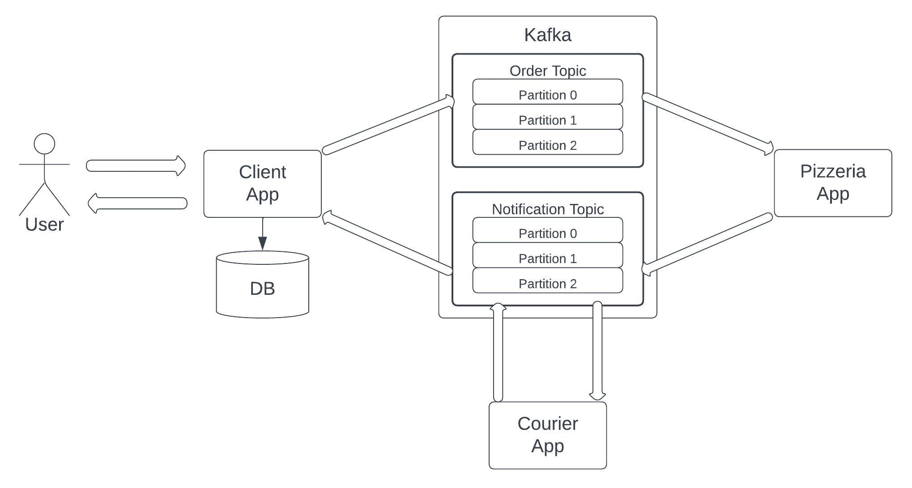

# Pizzeria 

Project consists of three Spring Boot applications, that communicate asynchronously using Kafka:

Client App has a database and REST endpoints for placing and monitoring orders.

## How to run
You can use Docker Compose to run Kafka and Spring Boot applications. Steps:
1. Run `docker-compose up -d` in the project root.
2. Use Swagger or import `Kafka Pizzeria.postman_collection.json` in Postman. 
Use `POST` endpoint for placing order and `GET` for order status monitoring.

Swagger: http://localhost:8080/pizzeria/swagger-ui/index.html

## Notes
- Spring Boot 3 and Java 17 are used.
- For each Spring Boot application a separate Maven module is created (`client`, `pizzeria`, `courier`).
- There is also `common` module for common logic - other modules depend on it.
- Client is integrated with MySQL DB. DB migration tool: Liquibase.
- Code coverage threshold: 85%. 
- Unit tests: JUnit 5, Mockito. Integration tests: MockMvc, TestContainers, H2.
- Checkstyle is configured.